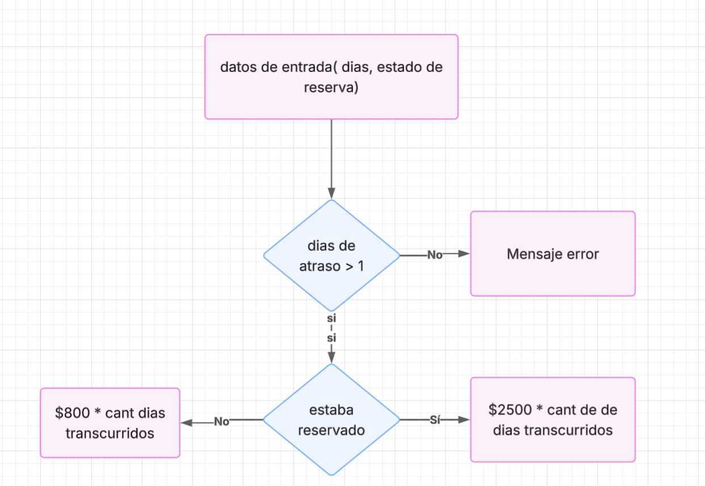

# Ejercicio 1

a) ¿Cuáles son las condiciones de aprobación de la materia?

Aprobar las 4 instancias: El portafolio completo, la evaluación escrita y el trabajo final.

b) ¿Qué porcentaje corresponde al Portafolio, a la evaluación escrita y al TPO?

Portafolio 30%, evaluación 30%, TPO 40%.

c) ¿Qué tipo de evidencias deberán incorporar al Portafolio durante la cursada?

De la resolución de los ejercicios que hacemos en clase.

d) ¿Cuál es el propósito del TPO y cómo se relaciona con los contenidos de cada unidad?

El objetivo es realizar un trabajo que integre todo lo visto a lo largo de la materia.

e) ¿Qué producciones serán grupales y cuáles requerirán una participación individual?

El trabajo final y el portafolio son grupales. El parcial es individual.

# Ejercicio 2

**Integrantes, comisión y canal de comunicación del equipo:**

- Nicole Quilmore
- Jesica Benitez
- Priscila Challa
- Canal de comunicación: WhatsApp y Teams
- Comisión: 584514

**Experiencia previa en programación y expectativas para la materia:**

Nicole: 5 años de experiencia en el ámbito, actualmente trabajo con Java, React y Oracle. Mi expectativa es seguir aprendiendo.
Jesica:
Priscila: 

**Nombre del equipo:** Error 404.

**Roles iniciales** (coordinación, desarrollo, documentación y pruebas):

- Jessica: Coordinación.
- Priscila: Desarrollo.
- Nicole: Documentación y Pruebas.

**Acuerdos básicos de trabajo:** vamos a utilizar GitHub como versionado y VS Code como IDE.

# 3. Problema – Algoritmo – Programa

Antes de resolver, diferencien los siguientes conceptos:

- **Problema:** situación que requiere una solución y que debe ser comprendida antes de programar.
- **Algoritmo:** secuencia finita, ordenada y precisa de pasos para resolver el problema, independiente de un lenguaje de programación.
- **Programa:** implementación del algoritmo mediante las instrucciones y la sintaxis de un lenguaje.

## Ejercicio integrador

Una biblioteca universitaria cobra una multa de $800 por cada día de atraso. Si el libro fue devuelto con al menos un día de atraso y estaba reservado por otra persona, se agrega un cargo fijo de $2500. La cantidad de días no puede ser negativa.

*Ing. María Eugenia Varando*

a) Identifiquen los datos de entrada, el procesamiento y la salida.
Entrada: 
- Dias de atraso > 0
- Estado de la reserva del libro

Procesamiento:
- Calculo de valor de multa

Salida:
- Valor final de la multa

b) Propongan al menos cuatro casos de prueba, incluyendo situaciones límite.

1) Dias de atraso > 0
2) Dias de atraso < 0
3) Libro reservado
4) Libro sin reservar

c) Escriban el algoritmo en lenguaje natural o pseudocódigo.

int diasAtraso;
bool estadoReserva;

funcion calculo_multa(estadoReserva, diasAtraso)
    if(estadoReserva) return (diasAtraso * 800) + 2500;
    return diasAtraso * 800;


d) Representen la solución mediante un diagrama de flujo.



e) Implementen el programa en Python y comparen los resultados obtenidos con los casos de prueba.
Resulto en archivo ejercicio-3.py

# 4. Estructuras de datos

Analicen las siguientes formas de organizar información:

- **Variable simple:** almacena un único valor.
- **Lista:** secuencia unidimensional de elementos a los que se accede mediante un índice.
- **Matriz:** organización conceptual en filas y columnas. En Python se representa mediante una lista de listas y se accede con dos índices: `matriz[fila][columna]`.

Para el problema de la biblioteca, indiquen qué estructura utilizarían para representar:

a) Los datos de una única devolución.
dias_atraso, estado_reserva son valores unicos que no cambian a lo largo de la ejercución

b) Las multas cobradas durante un día.
Lista de numeros que representa todos los valores de las multas cobradas en el dia: multas_diarias[int]

c) La recaudación de cuatro sucursales durante siete días.
recaudacion_sucursales[7,4] (7 filas que representan los valores para cada dia, 4 columnas que representan a cada sucursal)

Justifiquen cada elección considerando la cantidad de datos y la forma en que deberán recorrerse.

# 5. Repaso de programación modular y funciones

La programación modular permite dividir un problema complejo en subproblemas más pequeños. Cada función debe tener un objetivo claro, recibir la información necesaria mediante parámetros y comunicar su resultado mediante `return` cuando corresponda.

Implementen y documenten las siguientes funciones:

```python
def calcular_multa(dias_atraso, reservado):
    """Retorna el importe de la multa. reservado es un valor booleano."""

def mostrar_resultado(nombre_usuario, importe):
    """Muestra el importe correspondiente a un usuario."""
```

a) Utilicen nombres descriptivos, parámetros y variables locales.

b) No utilicen variables globales.

c) Desde el programa principal, soliciten los datos, conviertan la respuesta S/N a un valor booleano y llamen a ambas funciones.

d) Expliquen la diferencia entre retornar un valor y mostrarlo en pantalla.

e) Prueben las funciones con los casos definidos en la actividad anterior.

# 6. Repaso de listas

Registren en una lista las multas correspondientes a 10 usuarios. Para cada usuario, soliciten los datos necesarios y utilicen `calcular_multa()`.

*Ing. María Eugenia Varando*

Luego implementen funciones que permitan:

a) Mostrar todos los importes almacenados.

b) Retornar la multa de mayor importe.

c) Calcular y retornar el importe promedio.

d) Contar cuántas multas superan un límite recibido como parámetro.

e) Informar cuántos usuarios no recibieron multa.

Verifiquen que las funciones reciban la lista como parámetro y que cada una resuelva una única responsabilidad.

# 7. Repaso de matrices

Una biblioteca posee 4 sucursales y registra la recaudación por multas durante 7 días. Representen la información mediante una matriz de 4 filas y 7 columnas: cada fila corresponde a una sucursal y cada columna a un día.

Creen la matriz con filas independientes. Eviten replicar una lista completa, porque todas las filas podrían referenciar el mismo objeto.

```python
recaudacion = [[0 for columna in range(7)] for fila in range(4)]
```

a) Carguen valores mayores o iguales que cero.

b) Informen la recaudación total de cada sucursal.

c) Informen la recaudación total de cada día.

d) Calculen la recaudación general.

e) Indiquen el número de día con mayor recaudación total.

f) Expliquen qué representa cada índice en `recaudacion[fila][columna]`.

# Actividad para el Portafolio

Entreguen un único documento grupal que contenga:

- Ficha del equipo y acuerdos iniciales de trabajo.
- Análisis del problema: entradas, procesamiento y salidas.
- Algoritmo, diagrama de flujo y programa en Python.
- Código de las funciones y actividades con listas y matrices.
- Al menos cuatro casos de prueba con resultado esperado y resultado obtenido.
- Capturas de ejecución y una breve conclusión grupal.

Cada integrante deberá agregar una reflexión individual sobre los conceptos que pudo recuperar con seguridad y aquellos que necesita seguir reforzando.
